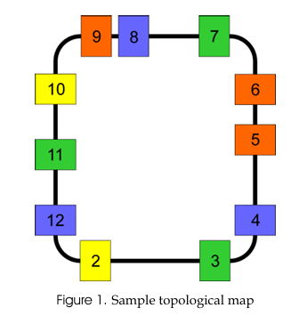

# Galbraith Memorial Mail Robot - ROB301 Final Project

This project aims to design a control system based on a Bayesian discrete-state localisation system for a TurtleBot3 Waffle Pi robot to navigate a closed-loop route and simulate mail delivery to arbitrarily chosen locations on that closed loop route. The robot uses a probabilistic filter to determine its position from colour observations alone, then delivers mail to target offices once localisation converges.

---

## Background

This simulation is a continuation of a physical ROB301 project originally implemented on a real TurtleBot3 Waffle Pi running **ROS1**. The Bayesian filter design, track layout, and state space are identical to the original — the differences are sensor calibration (real camera vs. Gazebo Harmonic Ogre2 renderer) and the migration to a ROS2 Jazzy / Gazebo Harmonic architecture.

**Topological map (same for both physical and simulated versions):**



📄 [Original Final Report](docs/final_report.pdf) - physical robot implementation, filter derivation, and results

📸 [Photos of the physical robot](docs/photos/)

---

## System Requirements

- Ubuntu 24.04 (bare-metal or WSL2 with WSLg for GUI)
- ROS2 Jazzy
- Gazebo Harmonic (`gz-sim` 8.x)
- Python 3.12+ with `numpy`, `matplotlib`, `opencv-python`, `cv_bridge`

---

## Workspace Setup

```bash
mkdir -p ~/gazebo_projects/src
cd ~/gazebo_projects

# Clone this repo into the workspace root
git clone https://github.com/manansawrangpate/Bayesian-Localization-Robot.git .

# Clone TurtleBot3 dependencies (Jazzy branch)
cd src
git clone -b jazzy https://github.com/ROBOTIS-GIT/turtlebot3.git
git clone -b jazzy https://github.com/ROBOTIS-GIT/turtlebot3_msgs.git
git clone -b jazzy https://github.com/ROBOTIS-GIT/turtlebot3_simulations.git
git clone -b jazzy https://github.com/ROBOTIS-GIT/DynamixelSDK.git
cd ..

# Install ROS dependencies
rosdep install --from-paths src --ignore-src -r -y

# Build (symlink-install means Python files are live-editable — no rebuild after edits)
colcon build --symlink-install
source install/setup.bash
```

---

## Running the Simulation

Open four terminals, each sourced with `source ~/gazebo_projects/install/setup.bash`:

```bash
# Terminal 1: Gazebo world + robot spawn
ros2 launch bayesian_localization_project turtlebot3.launch.py

# Terminal 2: Camera perception (colour detection + line tracking)
ros2 run bayesian_localization_project perception_node

# Terminal 3: Bayesian localisation + delivery controller
ros2 run bayesian_localization_project bayes_loc_node

# Terminal 4: Live belief bar chart
ros2 run bayesian_localization_project belief_visualizer
```

---

## Track Layout

The world is a closed rectangular loop (~14 m perimeter) with 11 colour-coded office patches and connecting grey corridors.

| State Index | Office | Colour   | Position (x, y)  | Side        |
|-------------|--------|----------|------------------|-------------|
| 0           | 2      | Yellow   | (-1.1, -1.6)     | Bottom      |
| 1           | 3      | Green    | (1.0, -1.6)      | Bottom      |
| 2           | 4      | Blue     | (2.05, -0.95)    | Right lower |
| 3           | 5      | Orange   | (2.05, -0.15)    | Right mid   |
| 4           | 6      | Orange   | (2.05, 0.70)     | Right upper |
| 5           | 7      | Green    | (1.2, 1.6)       | Top right   |
| 6           | 8      | Blue     | (-0.15, 1.6)     | Top mid     |
| 7           | 9      | Orange   | (-0.95, 1.6)     | Top left    |
| 8           | 10     | Yellow   | (-1.8, 0.70)     | Left upper  |
| 9           | 11     | Green    | (-1.8, -0.20)    | Left mid    |
| 10          | 12     | Blue     | (-1.8, -1.0)     | Left lower  |
| 11          | —      | —        | (corridors)      | Traversal   |

---

## System Architecture

### Nodes

| Node | File | Role |
|------|------|------|
| `perception_node` | `perception_node.py` | Camera colour classification and line centre detection |
| `bayes_loc_node` | `bayes_loc_node.py` | Bayesian filter + proportional line-following controller + delivery action |
| `belief_visualizer` | `belief_visualizer.py` | Bar graph that shows belief distribution at any given time |

### Topics

| Topic | Type | Direction |
|-------|------|-----------|
| `/camera/image_raw` | `sensor_msgs/Image` | Gazebo -> perception |
| `/mean_img_rgb` | `std_msgs/Float64MultiArray` | perception -> bayes |
| `/line_idx` | `std_msgs/UInt32` | perception -> bayes |
| `/cmd_vel` | `geometry_msgs/TwistStamped` | bayes -> Gazebo |
| `/belief` | `std_msgs/Float64MultiArray` | bayes -> visualiser |
| `/bayes_status` | `std_msgs/String` | bayes -> visualiser |

---

## Bayesian Filter Design

### State Space

12 states: offices 2–12 (indices 0–10) + traversal (index 11). The robot knows the map but not its starting position and belief is initialised as a uniform prior (1/12 each).

### Transition Model

Office states form a **circular chain mod 11** (index 0 after index 10). Traversal sits outside this circle — when leaving traversal, belief spreads uniformly across all 11 offices (resolved by the next colour measurement).

| Action | P(retreat) | P(stay) | P(advance) |
|--------|-----------|---------|-----------|
| Forward (+1) | 0.05 | 0.10 | 0.85 |
| Stationary (0) | 0.05 | 0.90 | 0.05 |

### Measurement Model

`p(z | true colour)` columns represent the true colour of each state:

| Observation | Blue | Green | Yellow | Orange | Traversal |
|-------------|------|-------|--------|--------|-----------|
| blue        | 0.65 | 0.15  | 0.05   | 0.10   | 0.05      |
| green       | 0.15 | 0.65  | 0.05   | 0.10   | 0.05      |
| yellow      | 0.05 | 0.05  | 0.70   | 0.15   | 0.05      |
| orange      | 0.10 | 0.10  | 0.15   | 0.60   | 0.05      |
| nothing     | 0.05 | 0.05  | 0.05   | 0.05   | 0.80      |

### Belief Floor

After every update, `belief = max(belief, 0.01)` is applied before renormalisation. This prevents any state from reaching exactly 0 (which would permanently eliminate it). 

### Predict / Update Trigger Logic

The filter uses a **corridor-freeze** strategy to avoid double-advancing the belief per corridor:

| Event | Filter action |
|-------|--------------|
| `colour -> nothing` (entering corridor) | Predict once + update with 'nothing' |
| Sustained `nothing` (mid-corridor) | **Freeze** - no predict, no update |
| `nothing -> colour` (exiting corridor) | Update only (predict already fired on entry) |
| `colour_A -> colour_B` (direct patch-to-patch) | Predict + update |
| Sustained same colour | Update only (reinforces current office) |

---

## Two-Phase Operation

### 1 Exploration

The robot drives a full lap before attempting any delivery. Exploration completes when 11 `nothing to colour` transitions are counted (one per office entered). 

### 2 Delivery

Once exploration is complete, the robot delivers mail to target offices (default: offices 6, 8, 10). Delivery triggers when:

- The MAP (most probable) estimate has been the same office state for 8 consecutive frames (~0.8 s at 10 Hz)
- A colour is currently visible (not mid-corridor)

On trigger, the robot line-follows for 16 seconds to reach the physical centre of the patch, then stops, rotates 90°, waits 1 s, rotates back, and drives forward briefly to simulate mail drop.

---

## Perception

The camera is mounted with a ~80° downward pitch so it detects patches only when the robot is physically over them, preventing early delivery triggers.

Colour classification uses calibrated Ogre2 RGB thresholds.

| Colour | Rule |
|--------|------|
| Yellow | `r > 200 and g > 200 and abs(r−g) < 25 and r > b+3` |
| Orange | `r > 160 and b < 80 and r > g×1.12` |
| Green  | `g > 130 and g > r×1.10 and g > b×1.10` |
| Blue   | `b > 130 and b > r×1.20 and b > g×1.20` |

The colour region of interest is the bottom 25% of the image (`COLOUR_ROW_START = 0.75`). 
---

## Spawn Position

Default: `(0.6, -1.6)` facing `+x` midway along the bottom straight. For changing robot start position change `x_pose`, `y_pose`, and optionally `-Y` (yaw in radians) in `launch/turtlebot3.launch.py`.

---

## Live Visualiser

The `belief_visualizer` node displays a live bar chart of the 12-state belief distribution:

- Bars are coloured to match each office's physical patch colour
- The MAP estimate bar is highlighted with a white border
- The status line at the top shows current observation, MAP estimate, probability, confidence frame count, and operating mode

---

## Key Parameters

| Parameter | Value | Location |
|-----------|-------|----------|
| `LINEAR_VEL` | 0.08 m/s | `bayes_loc_node.py` |
| `KP` (line following) | 0.002 | `bayes_loc_node.py` |
| `BELIEF_FLOOR` | 0.01 | `bayes_loc_node.py` |
| `MIN_CONFIDENT_FRAMES` | 8 | `bayes_loc_node.py` |
| `EXPLORATION_PATCHES` | 11 | `bayes_loc_node.py` |
| `MAX_EXPLORE_SECONDS` | 240 s | `bayes_loc_node.py` |
| Delivery approach time | 16 s | `bayes_loc_node.py` |
| `SAT_THRESHOLD` | 60 | `perception_node.py` |
| `MIN_COLOURED_PIXELS` | 100 | `perception_node.py` |
| `COLOUR_ROW_START` | 0.75 | `perception_node.py` |
| Camera pitch | -1.4 rad (~80°) | `models/turtlebot3_waffle_pi/model.sdf` |
